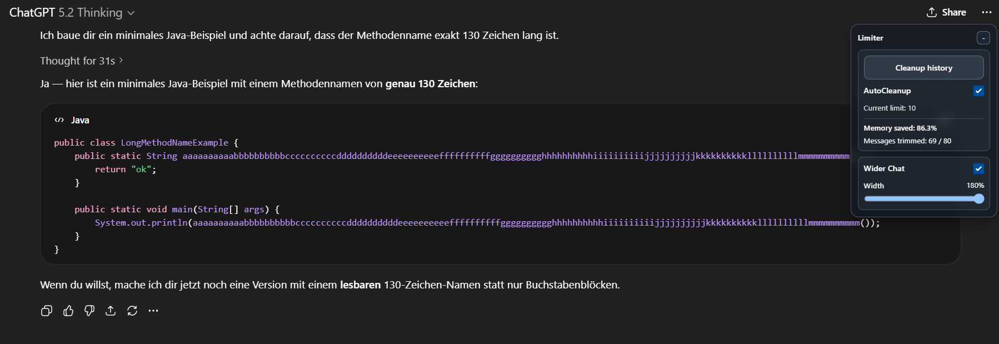
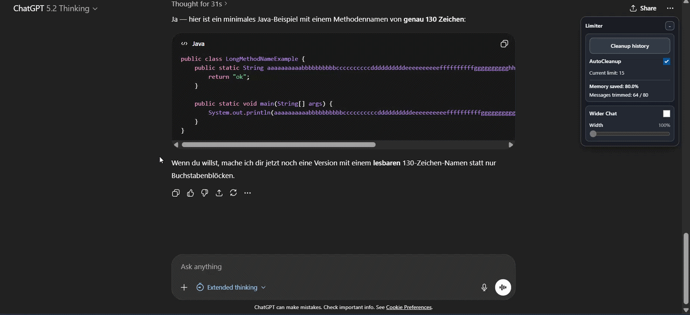

# ChatGPT Config
A Tampermonkey userscript for https://chatgpt.com that keeps conversation mappings compact and adds practical UI controls.

## Why this script
Long chats can build up large mapping payloads. This script trims mapping data to keep only the root node + the latest N messages, while giving you quick controls directly in the ChatGPT UI.

## Privacy
- No external API calls are added by this script.
- Data is stored locally in browser `localStorage`.
- Script runs only on `https://chatgpt.com/*`.

### Why this does not impact ChatGPT context
This script does not modify outgoing prompt content or server-side conversation state. It only trims conversation mapping data in browser-visible responses, so model-side context construction is unchanged.

## Features
- AutoCleanup: Keep only root + latest N messages
- Load More button at top while scrolling up
- Draggable and collapsible mini panel
- Inline edit for message limit (double click on status)
- Wider Chat toggle with width slider
- Live metrics:
  - Memory saved percentage
  - Messages trimmed (trimmed / total)
- Per-conversation + global persistence via localStorage
- Optional debug logs with console controls

## Screenshots
_Utility box (foldable):_

_Short interaction demo:_

## Install
### Option 1: Raw GitHub URL (recommended)
1. Install Tampermonkey in your browser: https://www.tampermonkey.net/
2. Open this direct raw URL: https://raw.githubusercontent.com/0xBADBAC0N/chatgpt-config/main/chatgpt-config.user.js
3. Tampermonkey will prompt installation.
4. Confirm and open `https://chatgpt.com`.

### Option 2: Manual import
1. Open Tampermonkey dashboard.
2. Create a new script.
3. Paste the content of `chatgpt-config.user.js`.
4. Save.

## Usage
- Open any ChatGPT conversation
- Use the mini panel:
  - `Cleanup history` to apply trimming immediately
  - `AutoCleanup` on/off
  - `Wider Chat` on/off + width slider
- Double click `Current limit` to set custom keep count
- Scroll up near the top to reveal `Load +50 messages`

## License
MIT (see `LICENSE`).
